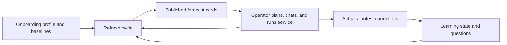

# 01 - System Overview

StormReady V3 forecasts dinner cover counts for restaurants, explains the main
drivers, collects operator context, and learns from actuals and feedback over
time.

Runtime is a single backend application backed by DuckDB, a React workspace UI,
and a small agent framework. Deterministic services own the forecast math and
database writes. Agents add structured interpretation, summaries, questions, and
operator-facing language.

## Main Loop

## Layers

| Layer | Main files | Responsibility |
|---|---|---|
| Frontend | `frontend/src/App.tsx`, `frontend/src/api.ts`, `frontend/src/types.ts` | Operator workspace, onboarding, forecast cards, chat, plans, actuals |
| API | `api/app.py`, `api/service.py` | HTTP routes, request validation, workspace serialization |
| Agents | `agents/base.py`, `agents/factory.py`, `agents/policies/*.md` | Dispatcher roles for signal, retrieval, chat, note, anomaly, governance |
| Orchestration | `orchestration/orchestrator.py`, `orchestration/supervisor.py` | Refresh planning, source fetch, prediction, publishing, retriever hooks |
| Prediction | `prediction/engine.py`, `prediction/priors.py`, `prediction/scenarios.py` | Deterministic expected covers, intervals, attribution, scenarios |
| Conversation | `conversation/*`, `agents/tools.py` | Chat context, notes, learning agenda, hypothesis promotion, query tools |
| Storage | `storage/db.py`, `storage/repositories.py`, `db/migrations/*.sql` | DuckDB migrations, repositories, persisted runtime state |
| External | `sources/*`, `connectors/*`, `external_intelligence/*`, `ai/*` | Weather, local context, connector truth, source catalog, model provider |

## Agent Roles

| Role | When it runs | Output |
|---|---|---|
| `signal_interpreter` | During refresh after source fetch | Typed external demand signals |
| `prediction_governor` | During forecast generation | Driver emphasis, uncertainty notes, governance metadata |
| `current_state_retriever` | After refresh/actual/note/setup events | `current_state` digest |
| `temporal_memory_retriever` | After actual/note/setup events | `temporal` digest |
| `conversation_orchestrator` | Chat turn | Grounded text and tool calls |
| `conversation_note_extractor` | Note capture | Structured facts, observations, corrections, service-state hints |
| `anomaly_explainer` | After large normal-service misses | Hypothesis candidates |

The dispatcher is built in `agents/factory.py::build_agent_dispatcher` and is
stored on `app.state.agent_dispatcher` by the FastAPI lifespan.

## Core State Flow

1. Onboarding writes `operators`, `operator_weekly_baselines`, location context,
   setup digests, and an optional setup bootstrap job.
2. Refresh loads profile, baselines, learning state, external payloads, connector
   truth, and prior forecast state.
3. Prediction writes `prediction_runs`, components, engine digests, weather
   assessments, scenarios, source evidence, and published/working forecast state.
4. Workspace serialization reads the published strip, conversation context,
   attention summary, learning agenda, service plans, notifications, and weather.
5. Actual logging writes `operator_actuals`, `prediction_evaluations`, learning
   states, notes, hypotheses, and digest refreshes.
6. Chat reads digests and conversation memory. For date-specific forecast
   why/weather follow-ups, it may attach a compact `forecast_why` packet before
   the model reply. Chat can also call tools and can write messages, notes,
   facts, decisions, and refresh requests.

## Entry Points

- HTTP app: `api/app.py`
- Workspace builder: `api/service.py::build_workspace`
- Onboarding: `api/service.py::complete_onboarding`
- Chat: `agents/unified.py::UnifiedAgentService.respond`
- Refresh cycle: `orchestration/orchestrator.py::DeterministicOrchestrator.run_refresh_cycle`
- Actual logging: `workflows/actuals.py::record_actual_total_and_update`
- Retriever hooks: `workflows/retriever_hooks.py::run_retriever_hooks`

See also: [02_frontend.md](02_frontend.md), [03_api_layer.md](03_api_layer.md),
[04_agents.md](04_agents.md), [05_orchestration.md](05_orchestration.md),
[06_data_layer.md](06_data_layer.md), [07_external_world.md](07_external_world.md).
